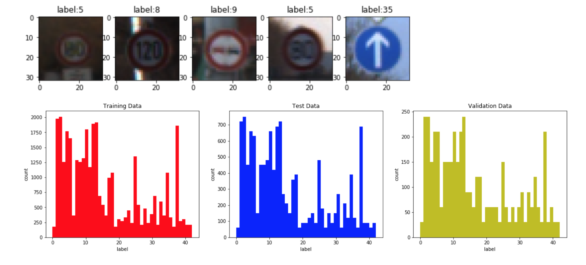
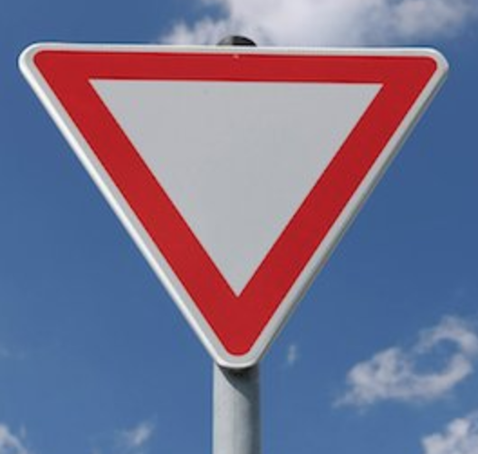
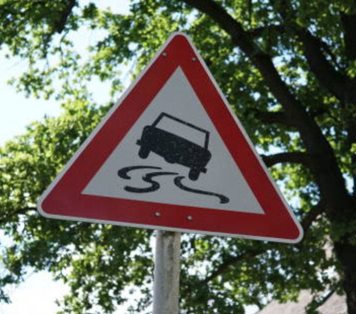
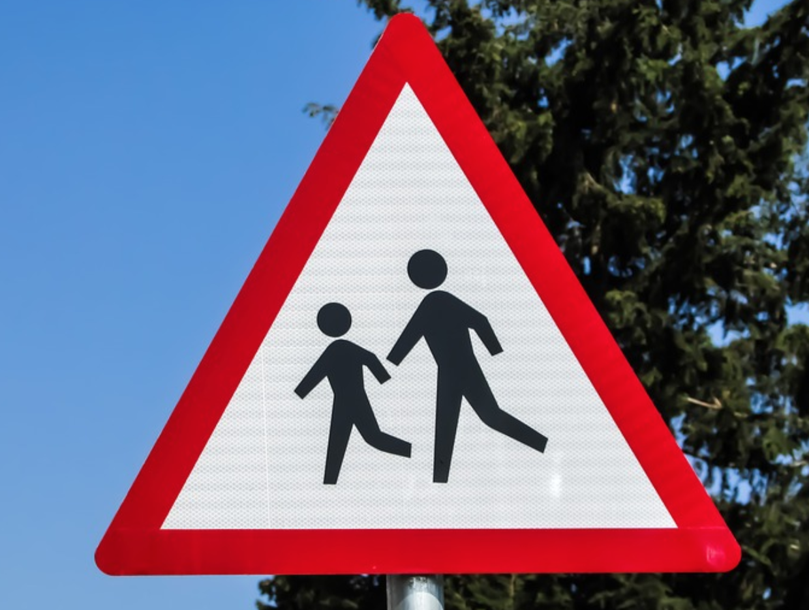
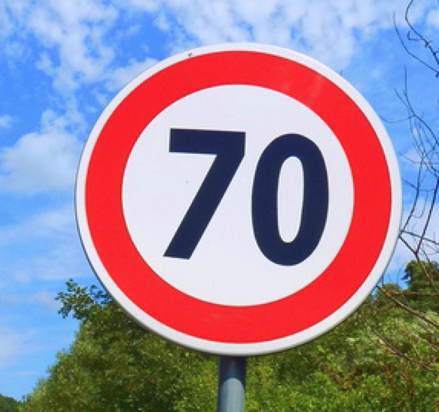
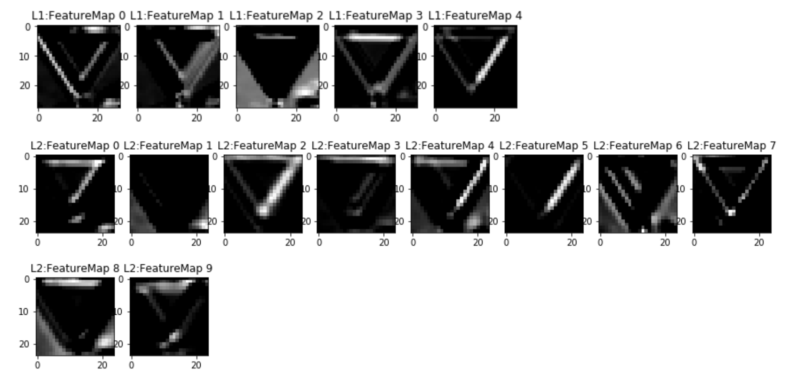

## Traffic Sign Recognition

---

**Build a Traffic Signs Classifier**

The goals / steps of this project are the following:
* Load the data set (see below for links to the project data set)
* Explore, summarize and visualize the data set
* Design, train and test a model architecture
* Use the model to make predictions on new images
* Analyze the softmax probabilities of the new images
* Summarize the results with a written report

## Rubric Points
Here I will consider the [rubric points](https://review.udacity.com/#!/rubrics/481/view) individually and describe how I addressed each point in my implementation.  

### Data Set Summary & Exploration

I used the numpy library to calculate summary statistics of the traffic signs data set:

| Data Type            |     Value	     			| 
|:--------------------:|:-----------------:| 
| Training Data Size   | 34799   					    	| 
| Validation Data Size | 4410	             |
| Test Data Size       | 12630	            |
| Image Shape          |	32 x 32 x	3				  	|
| Unique Classes       |	43	   									  	|

Here is an exploratory visualization of the data set. As we can see, the classes distribution is very similar accross training, validation and test set.

<p align="center">
  
  <br>
  <em>Figure 1: Visualization of Dataset</em>
</p>

### Design and Test a Model Architecture

#### 1. Data Pre-processing

The only data pre-processing I did is normalization. For each image, it will be substracted with mean value and divided by their standard variance.
```python
X_train = (X_train - X_train.mean(axis=0)) / (X_train.std(axis = 0) + 1e-8)
```


#### 2. Network Architecture

My final model consisted of the following layers:

| Layer         		|     Description	        					| 
|:---------------------:|:---------------------------------------------:| 
| Input         		| 32x32x3 RGB image   							| 
| Convolution 5x5     	| 1x1 stride, valid padding, outputs 28x28x5 	|
| Batch Normalization   |                                               |
| RELU					|												|
| Dropout               | 0.4 dropout rate                              |
| Convolution 5x5 	    | 1x1 stride, valid padding, outputs 24x24x10 	|
| Batch Normalization   |                                               |
| RELU					|												|
| Dropout               | 0.4 dropout rate                              |
| Max Pooling 2x2       | 2x2 stride, outputs 12x12x10                  |
| Flatten 	        	| output 1440  									|
| Fully connected		| output 256  									|
| Dropout               | 0.4 dropout rate                              |
| Fully connected		| output 10        								|
| Softmax-Croos Entropy |                                               |
 


#### 3. Training Process
To train the model, I used ```AdamOptimizer``` with learning rate 0.001 and batch size 128. The final model was trained for 12 epochs.

#### 4. Accuracy Improvement
The original model I chose is LeNet(without dropout) from the previous class. The final accuracy is shown as Figure 2. I even did not apply data pre-processing to datasets. The final test accuracy stayed around 0.852 while training accuracy is much higher at 0.975.

<p align="center">
  <br>
  
  <br>
  <em>Figure 2: Initial Model Accuracy</em>
</p>

Apparently, the model is overfitted. I applied the following technoloy to address the overfit issue:
* Apply normalization to dataset.
* Add dropout layer after ReLu activation.
* Add batch normalization before ReLu activation.
* Reduce model complexity, including reducing number of filters in conv layer, reducing number of neurons in fully-connected layer. 


My final model training graph were:

<p align="center">
  <br>
  
  <br>
  <em>Figure 3: Final Model Accuracy</em>
</p>

The fianl accuracy is shown below:

| Type       |     Accuracy	  			| 
|:----------:|:-----------------:| 
| Training   | 0.995   					    	| 
| Validation | 0.942	            |
| Testing    |	0.933										  	|


#### 5 Test a Model on New Images

Here are six German traffic signs that I found on the web:
<p align="center">
  <br>
  
  
  
  
  
  
  <br>
  <em>Figure 4: Example new images from web</em>
</p>

The third image might be difficult to classify because the background is full of branches and green leaves. Also the ```Slipper Road ``` sign is a little more complicated in shape and image resizing (to 32x32x3) also reduced image quality, making it even harder to recognize for the network.

Here are the results of the prediction:

| Image			           |     Prediction	        					| 
|:--------------------:|:--------------------------------:| 
| Yield         		   | Yield   		    							    | 
| Stop      			     | Stop  										        | 
| Slipper road	       | ***Speed limit (20km/h)***       |
| Road work	      	   | Road work 					 				      |
| Children crossing    | Children crossing                |
| Speed limit (70km/h) | Speed limit (70km/h)  					  |


The model was able to correctly guess 4 of the 5 traffic signs, which gives an accuracy of 80%. This accuracy is much lower than we got for test set. Of course, the data size for sample images is too small so a single incorrect prediction can drastically affect the accuracy. 

The top five softmax probabilities for image 1,2,4,5,6 are **1.0** for the correct class and **0.0** for all the other classes. For image 3, we have:

| Image 3 Probability   |     Prediction	      				| 
|:---------------------:|:-----------------------------:| 
| 1.00000000e+00        | Speed limit (20km/h)          | 
| 2.71967654e-19    		| Speed limit (30km/h)          |
| 4.80966460e-26	      | No entry						   			  |
| 6.19991838e-36	      | General caution					 		  |
| 0.00000000e+00				| Speed limit (50km/h)      	  |

The prediction for image 3 is very similar to the others. The highest probability is still 1.0 and all the other prediction probabilities are very close to 0.0.


### Visualizing the Neural Network

The first conv layer and second conv layer activation maps are shown in Figure 5. As we can see, the first conv layer extracted low level feature like edges while second conv layer extracted shapes. 

<p align="center">
  <br>
  
  <br>
  <em>Figure 5: Neural Network Visualization</em>
</p>


