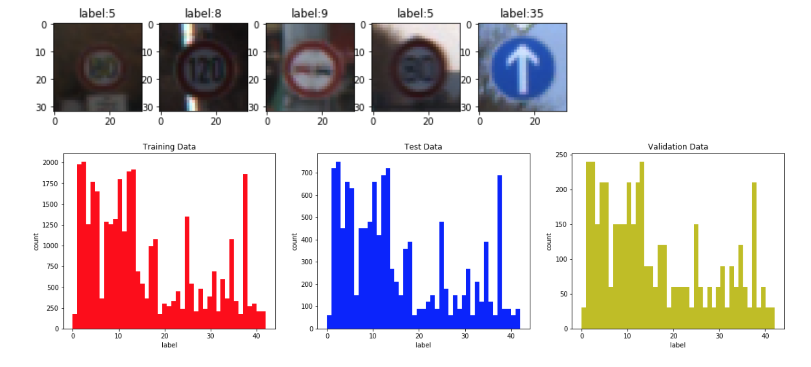
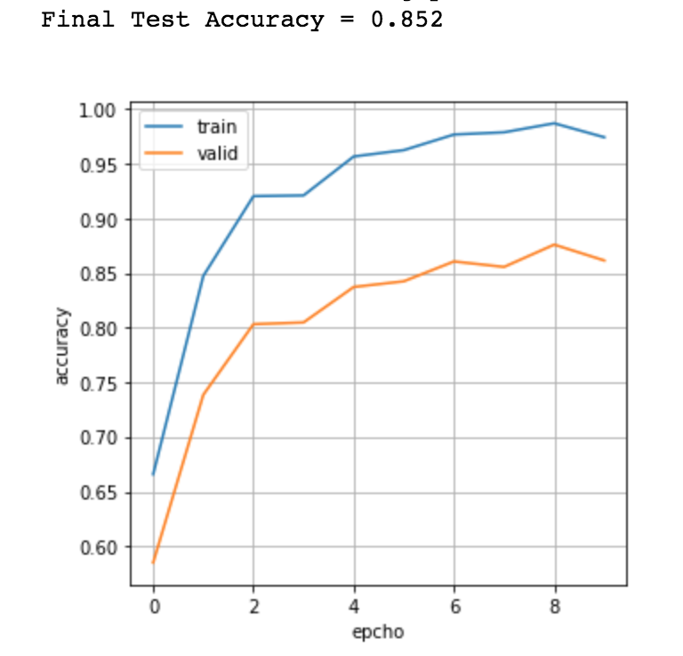
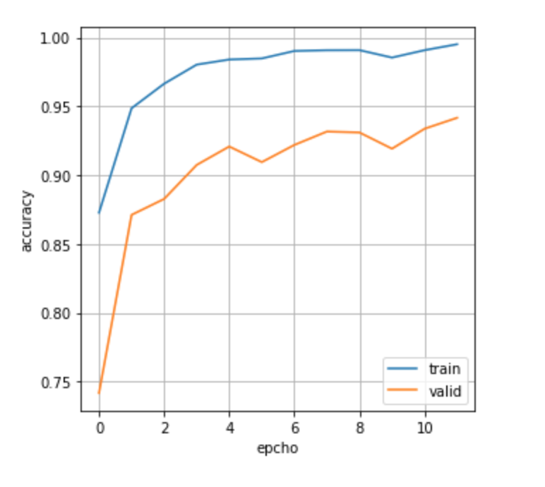

## Traffic Sign Recognition

---

**Build a Traffic Signs Classifier**

The goals / steps of this project are the following:
* Load the data set (see below for links to the project data set)
* Explore, summarize and visualize the data set
* Design, train and test a model architecture
* Use the model to make predictions on new images
* Analyze the softmax probabilities of the new images
* Summarize the results with a written report

## Rubric Points
Here I will consider the [rubric points](https://review.udacity.com/#!/rubrics/481/view) individually and describe how I addressed each point in my implementation.  

### Data Set Summary & Exploration

I used the numpy library to calculate summary statistics of the traffic signs data set:

| Data Type            |     Value	     			| 
|:--------------------:|:-----------------:| 
| Training Data Size   | 34799   					    	| 
| Validation Data Size | 4410	             |
| Test Data Size       | 12630	            |
| Image Shape          |	32 x 32 x	3				  	|
| Unique Classes       |	43	   									  	|

Here is an exploratory visualization of the data set. As we can see, the classes distribution is very similar accross training, validation and test set.

<p align="center">
  
  <br>
  <em>Figure 1: Visualization of Dataset</em>
</p>

### Design and Test a Model Architecture

#### 1. Data Pre-processing

The only data pre-processing I did is normalization. For each image, it will be substracted with mean value and divided by their standard variance.
```python
X_train = (X_train - X_train.mean(axis=0)) / (X_train.std(axis = 0) + 1e-8)
```


#### 2. Network Architecture

My final model consisted of the following layers:

| Layer         		|     Description	        					| 
|:---------------------:|:---------------------------------------------:| 
| Input         		| 32x32x3 RGB image   							| 
| Convolution 5x5     	| 1x1 stride, valid padding, outputs 28x28x5 	|
| Batch Normalization   |                                               |
| RELU					|												|
| Dropout               | 0.4 dropout rate                              |
| Convolution 5x5 	    | 1x1 stride, valid padding, outputs 24x24x10 	|
| Batch Normalization   |                                               |
| RELU					|												|
| Dropout               | 0.4 dropout rate                              |
| Max Pooling 2x2       | 2x2 stride, outputs 12x12x10                  |
| Flatten 	        	| output 1440  									|
| Fully connected		| output 256  									|
| Dropout               | 0.4 dropout rate                              |
| Fully connected		| output 10        								|
| Softmax-Croos Entropy |                                               |
 


#### 3. Training Process
To train the model, I used ```AdamOptimizer``` with learning rate 0.001 and batch size 128. The final model was trained for 12 epochs.

#### 4. Describe the approach taken for finding a solution and getting the validation set accuracy to be at least 0.93. Include in the discussion the results on the training, validation and test sets and where in the code these were calculated. Your approach may have been an iterative process, in which case, outline the steps you took to get to the final solution and why you chose those steps. Perhaps your solution involved an already well known implementation or architecture. In this case, discuss why you think the architecture is suitable for the current problem.

The original model I chose is LeNet(without dropout) from the previous class. The final accuracy is shown as Figure 2. I even did not apply data pre-processing to datasets. The final test accuracy stayed around 0.852 while training accuracy is much higher at 0.975.

<p align="center">
  <br>
  
  <em>Figure 2: Initial Model Accuracy</em>
</p>

Apparently, the model is overfitted. I applied the following technoloy to address the overfit issue:
* Apply normalization to dataset.
* Add dropout layer after ReLu activation.
* Add batch normalization before ReLu activation.
* Reduce model complexity, including reducing number of filters in conv layer, reducing number of neurons in fully-connected layer. 


My final model training graph and accuracy were:

<p align="center">
  <br>
  
  <em>Figure 3: Final Model Accuracy</em>
</p>

| Type       |     Accuracy	  			| 
|:----------:|:-----------------:| 
| Training   | 0.995   					    	| 
| Validation | 0.942	            |
| Testing    |	0.933										  	|


If an iterative approach was chosen:
* What was the first architecture that was tried and why was it chosen?
* What were some problems with the initial architecture?
* How was the architecture adjusted and why was it adjusted? Typical adjustments could include choosing a different model architecture, adding or taking away layers (pooling, dropout, convolution, etc), using an activation function or changing the activation function. One common justification for adjusting an architecture would be due to overfitting or underfitting. A high accuracy on the training set but low accuracy on the validation set indicates over fitting; a low accuracy on both sets indicates under fitting.
* Which parameters were tuned? How were they adjusted and why?
* What are some of the important design choices and why were they chosen? For example, why might a convolution layer work well with this problem? How might a dropout layer help with creating a successful model?


#### 5 Test a Model on New Images

####1. Choose five German traffic signs found on the web and provide them in the report. For each image, discuss what quality or qualities might be difficult to classify.

Here are five German traffic signs that I found on the web:

![alt text][image4] ![alt text][image5] ![alt text][image6] 
![alt text][image7] ![alt text][image8]

The first image might be difficult to classify because ...

####2. Discuss the model's predictions on these new traffic signs and compare the results to predicting on the test set. At a minimum, discuss what the predictions were, the accuracy on these new predictions, and compare the accuracy to the accuracy on the test set (OPTIONAL: Discuss the results in more detail as described in the "Stand Out Suggestions" part of the rubric).

Here are the results of the prediction:

| Image			        |     Prediction	        					| 
|:---------------------:|:---------------------------------------------:| 
| Stop Sign      		| Stop sign   									| 
| U-turn     			| U-turn 										|
| Yield					| Yield											|
| 100 km/h	      		| Bumpy Road					 				|
| Slippery Road			| Slippery Road      							|


The model was able to correctly guess 4 of the 5 traffic signs, which gives an accuracy of 80%. This compares favorably to the accuracy on the test set of ...

####3. Describe how certain the model is when predicting on each of the five new images by looking at the softmax probabilities for each prediction. Provide the top 5 softmax probabilities for each image along with the sign type of each probability. (OPTIONAL: as described in the "Stand Out Suggestions" part of the rubric, visualizations can also be provided such as bar charts)

The code for making predictions on my final model is located in the 11th cell of the Ipython notebook.

For the first image, the model is relatively sure that this is a stop sign (probability of 0.6), and the image does contain a stop sign. The top five soft max probabilities were

| Probability         	|     Prediction	        					| 
|:---------------------:|:---------------------------------------------:| 
| .60         			| Stop sign   									| 
| .20     				| U-turn 										|
| .05					| Yield											|
| .04	      			| Bumpy Road					 				|
| .01				    | Slippery Road      							|


For the second image ... 

### (Optional) Visualizing the Neural Network (See Step 4 of the Ipython notebook for more details)
####1. Discuss the visual output of your trained network's feature maps. What characteristics did the neural network use to make classifications?


